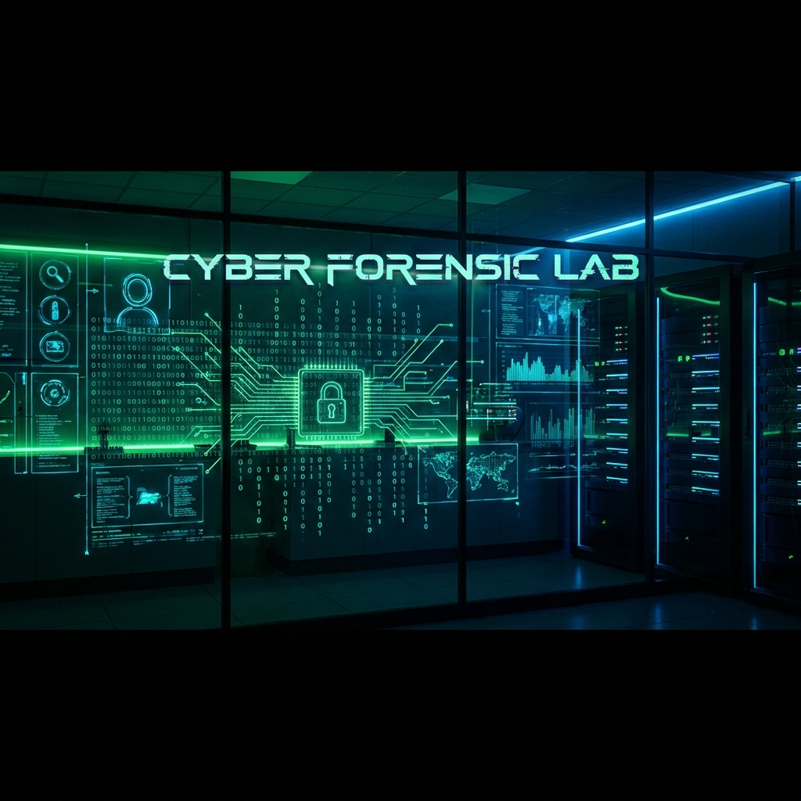
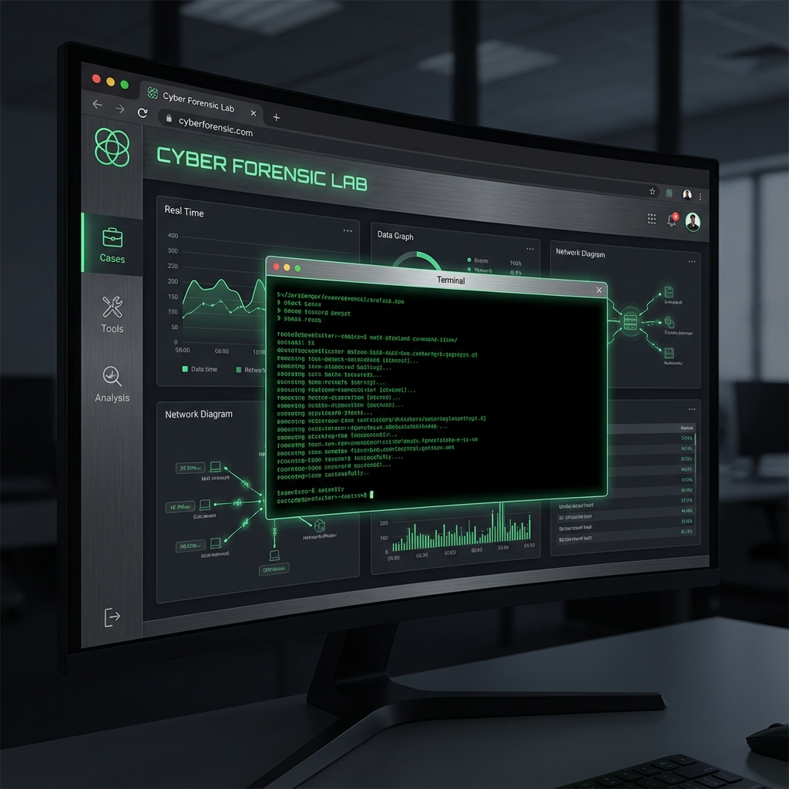

# 🕵️‍♂️ Cyber Forensic LAB




> **Simulate. Analyze. Solve.**
> An interactive web-based forensic simulation platform for students and faculty.

---

## ⚡ Quick Start

Get up and running in 3 steps:

1.  **Clone & Install**
    ```bash
    git clone https://github.com/MrRenntech/Cyber-Forensic-LAB.git
    npm install
    ```
2.  **Configure**
    Rename `.env.example` to `.env` and add your MongoDB URI.
3.  **Launch**
    ```bash
    node server.js
    ```

[👉 **Read the Full Setup Guide**](./docs/SETUP_GUIDE.md)

---

## 📸 Preview



**Immersive Interface**
The platform features a dark-mode, high-contrast UI designed for long investigation sessions. The central terminal allows for realistic command execution, while the surrounding panels provide real-time data visualization and case management.

---

## 📚 Documentation

Detailed documentation is available in the [`docs/`](./docs/) directory.

*   📖 **[Project Overview](./docs/PROJECT_OVERVIEW.md)** - Architecture & Tech Stack.
*   📂 **[Project Structure](./docs/PROJECT_STRUCTURE.md)** - File & folder breakdown.
*   🛠️ **[Setup Guide](./docs/SETUP_GUIDE.md)** - Step-by-step installation instructions.
*   🐛 **[Troubleshooting](./docs/TROUBLESHOOTING.md)** - Common errors and fixes.
*   📝 **[Changelog](./CHANGELOG.md)** - Version history and updates.

---

## 🌟 Features

*   **In-Browser CLI**: Realistic terminal loop for executing forensic tools.
*   **Role-Based Portals**: Separate dashboards for Students (Labs) and Faculty (Grading).
*   **Real-time Feedback**: Instant submission status updates.
*   **Dark Mode**: Optimized for low-light environments.

---

Developed with ❤️ by the **ForensicLab Team**.
