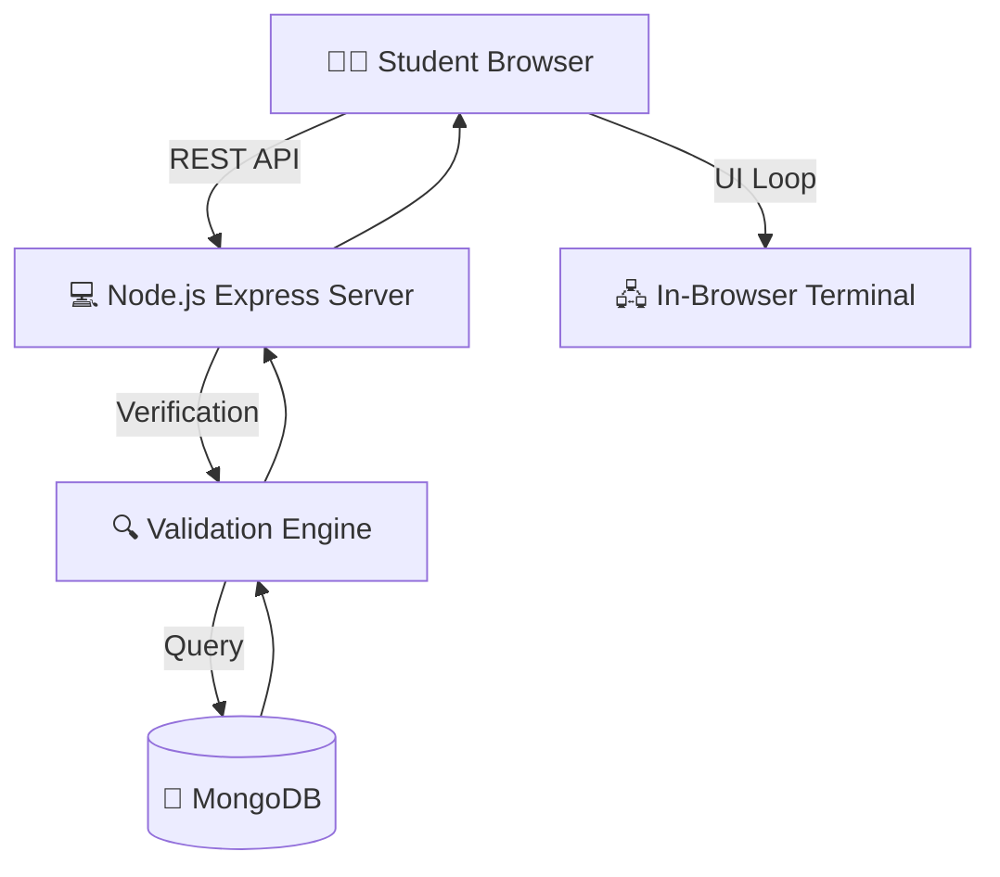

# 🕵️‍♂️ Cyber Forensic LAB

<div align="center">
  
  <br/>
  
  
  
</div>

> **Simulate. Analyze. Solve.**  
> An interactive web-based forensic simulation platform for students and faculty.

---

## 🏗️ Tech Architecture


```mermaid
graph TD
    Client[👨‍🎓 Student Browser] --> |REST API| NodeServer[💻 Node.js Express Server]
    Client --> |UI Loop| WebTerm[🖧 In-Browser Terminal]
    NodeServer --> |Verification| Engine[🔍 Validation Engine]
    Engine --> |Query| Mongo[(🍃 MongoDB)]
    Mongo --> Engine
    Engine --> NodeServer
    NodeServer --> Client
```

## ⚡ Quick Start
```bash
git clone https://github.com/MrRenntech/Cyber-Forensic-LAB.git
npm install
node server.js
```
